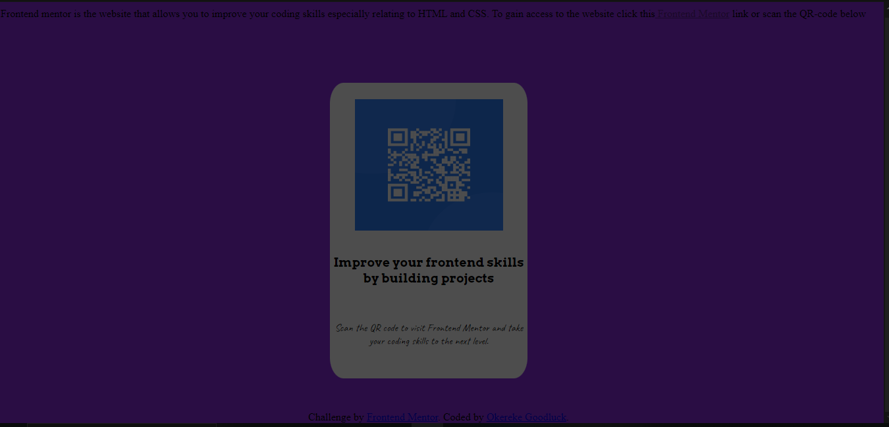

# Frontend Mentor - QR code component solution

This is a solution to the [QR code component challenge on Frontend Mentor](https://www.frontendmentor.io/challenges/qr-code-component-iux_sIO_H). Frontend Mentor challenges help you improve your coding skills by building realistic projects. 

## Table of contents

  - [Screenshot](#screenshot)
  - [Links](#links)
- [My process](#my-process)
  - [Built with](#built-with)
  - [What I learned](#what-i-learned)
  - [Continued development](#continued-development)
  - [Useful resources](#useful-resources)
- [Author](#author)

### Screenshot

- Solution URL: [Add solution URL here](http://127.0.0.1:5500/index.html)
- Live Site URL: [Add live site URL here](https://kreksman9.github.io/QR-code-webpage/)

## My process
Using HTML i created three div's; oen as the containing div, another for the QR-code picture and the last for the write up. I also added a footer. 
Next i used CSS to set the styles of the various div's. Taking advantage of the different properties in CSS i was able to arrange the different elements on the webpage. I also made use of media query to make the page a little responsive, however i was unable to make the QR-code responsive. 

### Built with

- Semantic HTML5 markup
- CSS custom properties
- Media Query

### What I learned
Through this project i was able to understand better how the position property(absolute and relative) work and theri different areas of application. Also how to manipulate web responsiveness using media qureies. I also saw how to check for a weboage responsiveness by using the chrome developer tools. 
'''
css
.atribute{position:relative;top: 25px} <!--Using positon property-->
.word {position:absolute; top:225px} 
@media (max-width:870) {footer{font-size:15px}}
'''

### Continued development
I would like to keep improving on making webpages responsive and designing more user friendly and appealing websites

### Useful resources
- [Example resource 1](https://developer.mozilla.org/en-US/) - This web developer website helped me with the media queries.
- [Example resource 2](https://www.udemy.com/) - From this online learning platform i got a tutorial guide on the use of Media queries

## Author

-Linkedin- [@Ifeanyi](https://www.linkedin.com/in/ifeanyi-goodluck-ab6a7a298?utm_source=share&utm_campaign=share_via&utm_content=profile&utm_medium=android_app)
- Frontend Mentor -[@Kreksman9](https://www.frontendmentor.io/profile/Kreksman9)
- Twitter - [@Acelucky](https://x.com/GOODLUCKIF4198?t=Uxse2wj6bS1Ke_xEHohvdQ&s=09)

